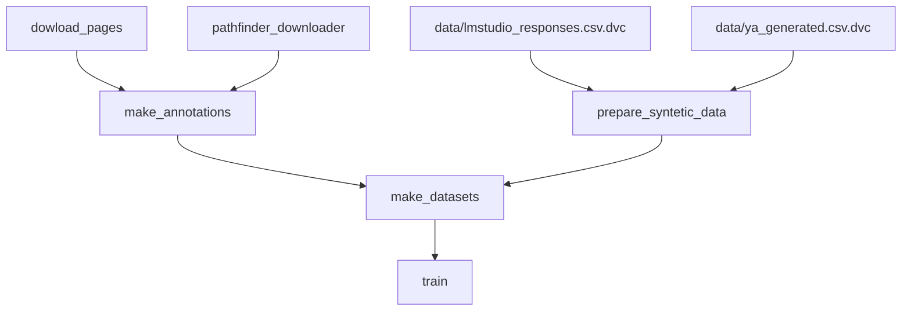

# NER for Dungeons & Dragons Entities

End-to-end пайплайн для сбора данных, обучения и развертывания модели для распознавания именованных сущностей (NER) в текстах по вселенной Dungeons & Dragons.

[](https://www.python.org/)
[](https://pytorch.org/)
[](https://huggingface.co/docs/transformers/index)
[](https://fastapi.tiangolo.com/)

## 📋 Состояние проекта

- [x] Пайплайн сбора и предобработки данных
- [x] Обучение и валидация моделей
- [x] Деплой модели как веб-сервиса
- [ ] Контейнеризация
- [ ] Настройка CI/CD

## 🛠️ Стек технологий

| Задача                          | Технология                                     |
| :------------------------------ | :--------------------------------------------- |
| **Сбор и предобработка данных** | `requests`, `pandas`, `beautifulsoup4`         |
| **EDA**                         | `jupyter`, `matplotlib`, `seaborn`             |
| **Обучение моделей**            | `pytorch`, `pytorch-lightning`, `transformers` |
| **Версионирование данных**      | `DVC`                                          |
| **Веб-фреймворк**               | `FastAPI`                                      |
| **Контейнеризация**             | `Docker` (в процессе)                          |
| **CI/CD**                       | `GitHub Actions` (в процессе)                  |

## 🚀 Мотивация

В настольной ролевой игре Dungeons and Dragons (D&D) правила рассредоточены по многочисленным книгам, и ключевые сущности — **Заклинания**, **Монстры** и **Магические предметы** — часто ссылаются друг на друга. Существующие инструменты NER общего назначения плохо справляются с задачей точного определения и связывания этих узкотематических сущностей.

Данный проект решает проблему автоматического извлечения и классификации D&D-сущностей из текста для последующего создания связанной базы знаний или быстрой навигации по правилам.

## 🗃️ Данные

Данные были получены путем парсинга веб-страниц ресурсов [dnd.su](https://dnd.su/) и [pathfinder.family](https://pathfinder.family/), где сущности уже размечены гиперссылками.

**Аугментация:** Для повышения устойчивости модели исходные тексты ссылок (`"Красный дракон [Red Dragon]"`) были аугментированы вариантами без переводов в скобках (`"Красный дракон"`).

**Синтетические данные:**
Метрики в первых экспериментах показывали плохие результаты на сущностях, ранее не всречаемых в обучении, а также в текстах, семантически отличающихся от текстов правил.
Поэтому было принято решения добавления синтетических данных.
Данные генерировались через:

- API YaGPT 5.1 ~ 50к текстов
- локально поднятую Phi 4 ~ 6к текстов

<details>
<summary>Промпт</summary>

```md
ты модель генератор текстов по днд, тебе необходимо сгенерировать 5 параграфов текстов в днд тематике с присутствием монствов, заклинаний или магических предметов в тексте. каждый такой объект помечай как ссылку в makrdown и в круглых скобках пиши, что это за объект (SPELL, MONSTER, ITEM)

ПРИМЕР ОФОМЛЕНИЯ ОБЪЕКТОВ:
[Волшебная стрела](SPELL)
[Высший вампир](MOSTER)
[Чудесные краски](ITEM)

ответь в формате json по следующему примеру :
{
"reasoning": "Я использую такие заклинания, как обнаружение зла и добра, обнаружении магии и исполнение желаний, монстров летучих мышей, волков и рой крыс, а также магические предметы: универсальный растворитель и масло эфирности, нужно сгенерировать 5 предложений и сделать их как можно более разнообразными по составу объектов, но при этом логичными и последовательными"
"sentenses": [ " В любое время во время вашего хода [сфера](ITEM) может наложить заклинание [внушение](SPELL) (Сл спасброска 17), нацеленное на вас или другое существо, которое коснулось шара в течение последних 24 часов. Это [сила сферы](ITEM), которую вы не контролируете.",
"Неограниченно: [изменение формы камня](SPELL) , [обнаружение зла и добра](SPELL) , [обнаружение магии](SPELL)",
"Например, если вы жрец 3-го уровня, то у вас есть четыре ячейки заклинаний 1-го уровня и две ячейки 2-го уровня. При Мудрости 16 ваш список подготовленных заклинаний может включать в себя шесть заклинаний 1-го или 2-го уровня в любой комбинации. Если вы подготовили заклинание 1-го уровня [лечение ран](SPELL), вы можете наложить его, используя ячейку 1-го уровня или ячейку 2-го уровня. Накладывание заклинания не удаляет его из списка подготовленных заклинаний.",
"Дети ночи (1/день). Вампир магическим образом призывает 2к4 [роя крыс](MONSTER) или [летучих мышей](MONSTER, при условии, что на небе нет солнца. Находясь на открытом воздухе, вампир может вместо этого призвать 3к6 [волков](MONSTER). Вызванные существа приходят через 1к4 раунда, действуют как союзники вампира и подчиняются его устным командам. Звери остаются на 1 час, пока вампир не умрет, или пока вампир не отпустит их бонусным действием.",
"Эта тягучая, молочно-белая субстанция может склеить два любых предмета. Она должна храниться в сосуде или фляге, покрытой изнутри [маслом скольжения](ITEM). В найденном контейнере находится 1к6 + 1 унция клея. Одна унция клея может покрыть 1 квадратный фут поверхности. Клей затвердевает через 1 минуту. После этого связь двух предметов можно разорвать только нанесением [универсального растворителя](ITEM) или [масла эфирности](ITEM), либо же заклинанием [исполнение желаний](ITEM)."]
}

не пиши никаких символов вне этого json, твой ответ обязательно должен быть на русском языке
```

Модель также получала на вход 9 сущностей (по 3 каждого класса) и должна была использовать их в текстах.

</details>

**Статистика оригинального датасета:**

- **Общий объем аугментированных данных:** 72663 текстовых примеров
- **Общее количество упоминаний сущностей:** 47643
- **Распределение по классам:**
  - Заклинание (Spell): `36452`
  - Монстр (Monster): `9692`
  - Магический предмет (Item): `1499`
- **Разбиение:** Train/Validation/Test = 80%/10%/10%

В Train добавляются синтетические данные, итоговый размер train выборки: `110552`

**Пример размеченного текста:**

```json
{
  "text": "Игрок может использовать заклинание Волшебная стрела, чтобы поразить Кобольда [Cobold], который держит Посох паука.",
  "annotations": [
    { "start": 32, "end": 47, "label": "SPELL" },
    { "start": 67, "end": 75, "label": "MONSTER" },
    { "start": 90, "end": 103, "label": "ITEM" }
  ]
}
```

## 🧠 Модель

В основе решения — дообученная языковая модель **BERT** (`cointegrated/rubert-tiny2` и `DeepPavlov/bert-base-bg-cs-pl-ru-cased`), над которой надстроен классификатор токенов.

Было исследовано две архитектуры классификатора:

1. **Авторегрессионная:** Учитывает эмбеддинг текущего токена и предсказанный класс предыдущего токена.
2. **Неавторегрессионная:** Классифицирует токены исключительно на основе их контекстуальных эмбеддингов от BERT.

**Финальная архитектура:** Модели с авторегрессионным или CRF подходом показывали хорошие результаты на валидейте, но быстро переобучались и проседали на тесте, поэтому используется независимая классификация токенов

**Гиперпараметры обучения:**

| Параметр                       | Значение                                                                 |
| :----------------------------- | :----------------------------------------------------------------------- |
| **Базовая модель**             | `cointegrated/rubert-tiny2` или `DeepPavlov/bert-base-bg-cs-pl-ru-cased` |
| **Learning Rate**              | 1e-5                                                                     |
| **Batch Size**                 | 32                                                                       |
| **Epochs**                     | 50                                                                       |
| **Dropout Rate**               | 0.1                                                                      |
| **Hidden Dim (классификатор)** | 256                                                                      |
| **Оптимизатор**                | AdamW                                                                    |

## 📊 Результаты и метрики

Модель оценивалась на тестовой выборке по метрикам **Precision, Recall и F1-score** (macro-average).

### Общие метрики

| Модель                                              | Precision | Recall | F1-score |
| :-------------------------------------------------- | :-------: | :----: | :------: |
| `bert-base-bg-cs-pl-ru-cased` + Baseline Classifier |  0.8221   | 0.8469 |  0.8333  |
| `rubert-tiny2` + Baseline Classifier                |  0.7698   | 0.8677 |  0.8138  |

### Детальная разбивка по классам (лучшая модель)

| Класс         | Precision | Recall | F1-score |
| :------------ | :-------: | :----: | :------: |
| **B-SPELL**   |  0.9214   | 0.9693 |  0.9447  |
| **I-SPELL**   |  0.9046   | 0.9824 |  0.9419  |
| **B-MONSTER** |  0.7657   | 0.7077 |  0.7355  |
| **I-MONSTER** |  0.7976   | 0.7736 |  0.7854  |
| **B-ITEM**    |  0.6744   | 0.6904 |  0.6823  |
| **I-ITEM**    |  0.6937   | 0.8112 |  0.7479  |

## 🚀 Деплой

Модель обернута в REST API сервис на основе **FastAPI**.

**Запуск сервиса:**

```bash
python model_service.py
```

**Эндпоинт `POST /predict`**

- **Запрос:**

```json
{
  "batch": [
    { "id": 0, "text": "Воин атакует двуручным мечом." },
    {
      "id": 1,
      "text": "Маг использует Заговор [Огненный шар] и призывает Скелета."
    }
  ]
}
```

- **Ответ:**

```json
{
  "results": [
    {
      "id": 0,
      "predictions": []
    },
    {
      "id": 1,
      "predictions": [
        { "start": 24, "end": 38, "label": "SPELL", "text": "Огненный шар" },
        { "start": 56, "end": 63, "label": "MONSTER", "text": "Скелета" }
      ]
    }
  ]
}
```

## Итоговый пайплайн



## 🛠️ Установка, запуск и обучение

### Bare metall

1. **Клонирование репозитория:**

   ```bash
   git clone https://github.com/monkeCode/dnd-text-entity-predictor.git
   cd dnd-text-entity-predictor
   ```

2. **Репродукция данных и запуск обучения:**

   ```bash
   dvc exp run
   ```

3. **Запуск сервиса:**

   ```bash
   python model_service.py models/model.pth
   ```

### Docker container

`TODO`

Документация API будет доступна по адресу: `http://localhost:8000/docs`
